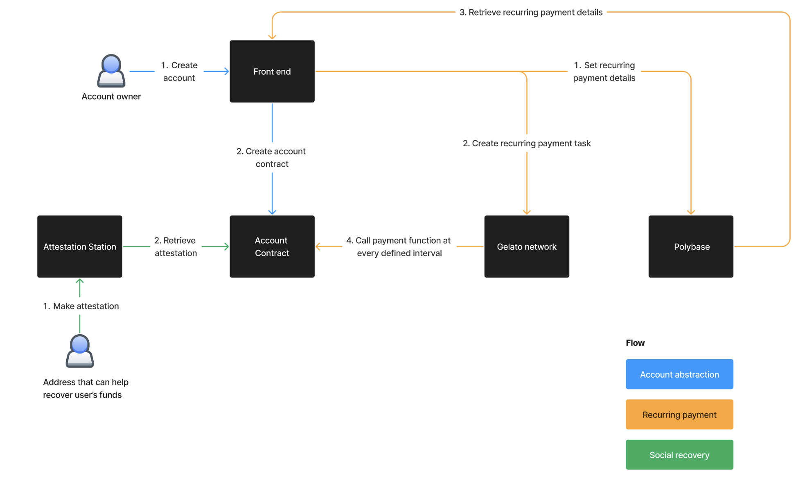

# RecurriPay

## Intro 👋
This project aims to tackle 2 key problems with crypto wallets. 

Currently, there is no easy way of making recurring payments because you cannot have event-based executions on smart contracts. As an externally owned account you are required to initiate the transaction every time. Some use cases which would have benefitted from this are automated loan repayment, subscription payment and payroll.

On the other hand, current crypto wallets are still susceptible to loss of private keys. The risk of losing all your funds without an avenue for recovery makes it hard to onboard more users. 

### What is RecurriPay? 

RecurriPay stands for "Recurring Payments". To put it simply, it is a wallet which enables recurring payments and social recovery. Under the hood, it uses Gelato Network to automate the recurring payment and Optimism’s Attestation Station to provide social recovery function. 

With account abstraction it has made wallet creation easier and more seamless. Social recovery function also enhances the user experience as now users can recover their wallet in the event of them losing their private key. Last but not least, being able to automate payments opens up a new capability for on-chain interactions such as paying for subscriptions or dollar-cost-averaging. 


### Try it yourself
[RecurriPay](https://recurripay.vercel.app/)


## Key features 🎲
### Account abstraction 👤

The frontend of this project is built using Nextjs. Under the hood, this project builds on top of the `@account-abstraction-sdk` by Eth-infinitism to enable first class citizen contract accounts. We wrote smart contracts inheriting from SimpleAccount and SimpleAccountFactory with additional features - recurring payment and social recovery. 

### Recurring payment 🔂

For the former, when a user sets up a recurring payment order, we write it to the account smart contract (`setUpRecurringPayment`), create a task in Gelato Network and store the payment details in Polybase. It will then call the specified function to execute the transaction (`makeRecurringPayment`) every interval defined by the user. 

### Social recovery 🤝

As for social recovery, we have integrated with Optimism’s Attestation Station to achieve this feature. To set up social recovery, the account owner would specify 3 addresses as their social recovery addresses. In the event of losing the key to the ReccuriPay account, the account owner would create a new wallet and ask the owners of the registered social recovery accounts to make attestations that the account is lost, and specify the new wallet address. When all 3 addresses have attested. A function can be called in the account contract to move any tokens or ETH to the attested new wallet address. Optimism’s Attestation Station is easy to integrate and provides a simple and secure mechanism to build our social recovery feature. 

### Putting it all together



## The stack 🛠️
- Frontend: `Next.js`
    - Styling: `tailwind` `lottie` 
- Account abstraction: `eth-infinitism account-abstraction-sdk`
- Transaction automation: `Gelato Network`
- Smart Contract Development:  `hardhat` `solidity`
    - Deploy and address export: `hardhat-deploy`
    - SDK: `openzeppelin` `ethers` 
- Attestation: `Optimism's Attestation Station`
- Bundler infrastructure: `Stackup`
- Database: `Polybase`

## Getting started 🏁
### To deploy hardhat
```
// install dependencies
npm install 


```
### To run frontend
```
//if you are from root, head to web directory
cd web

//install dependencies
npm install 

//run in local
npm run dev
```

## Deployments ⛓️
### Optimism Mainnet
[AttestationProxy](https://optimistic.etherscan.io/address/0xF400AEc6e1868d075Bf458B56990FeC79Da1557b#code)

### Optimistic Goerli
[AttestationStation](https://goerli-optimism.etherscan.io/address/0xdce225e1247e3AF602d3541168521a94a053F4bc#code)
[AttestationStationProxy](https://goerli-optimism.etherscan.io/address/0xc2361C2Eb9fc7010f7FCb9F79d7bFAEEFE5CDAb2#code)
[AttestationProxy](https://goerli-optimism.etherscan.io/address/0x9aB93189D582C6C2ED33EC658023650231188475#code)

### Scroll Alpha
[AttestationStation](https://blockscout.scroll.io/address/0x165B924538914B80162da3aB987065B43bbeE497/contracts#address-tabs)
[AttestationStationProxy](https://blockscout.scroll.io/address/0x725552d5a03766908d1A919B168a622187076756/contracts#address-tabs)
[AttestationProxy](https://blockscout.scroll.io/address/0x165B924538914B80162da3aB987065B43bbeE497/contracts#address-tabs)

### Polygon Mumbai
[AttestationStation](https://mumbai.polygonscan.com/address/0x165B924538914B80162da3aB987065B43bbeE497#code)
[AttestationStationProxy](https://mumbai.polygonscan.com/address/0x1a1f1720A3a4CF7E1DE28434672e6b61643a943D#code)
[AttestationProxy](https://mumbai.polygonscan.com/address/0x73b821968d8161Bff524Fae22c898f0CF6E32901#code)
